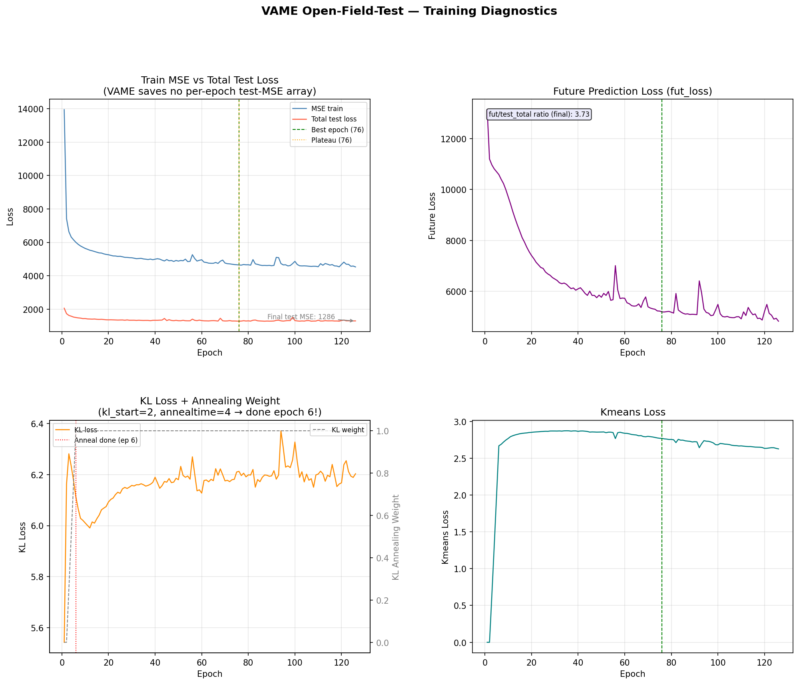
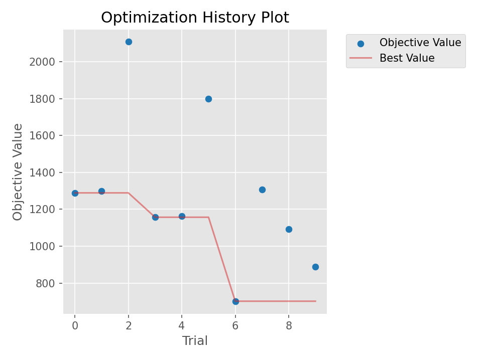
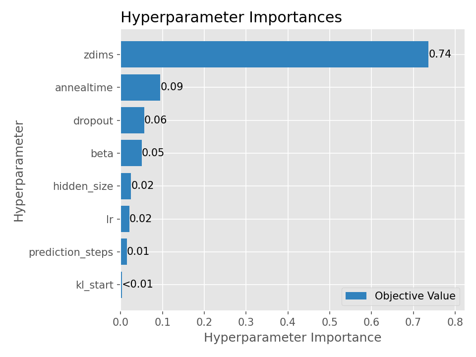
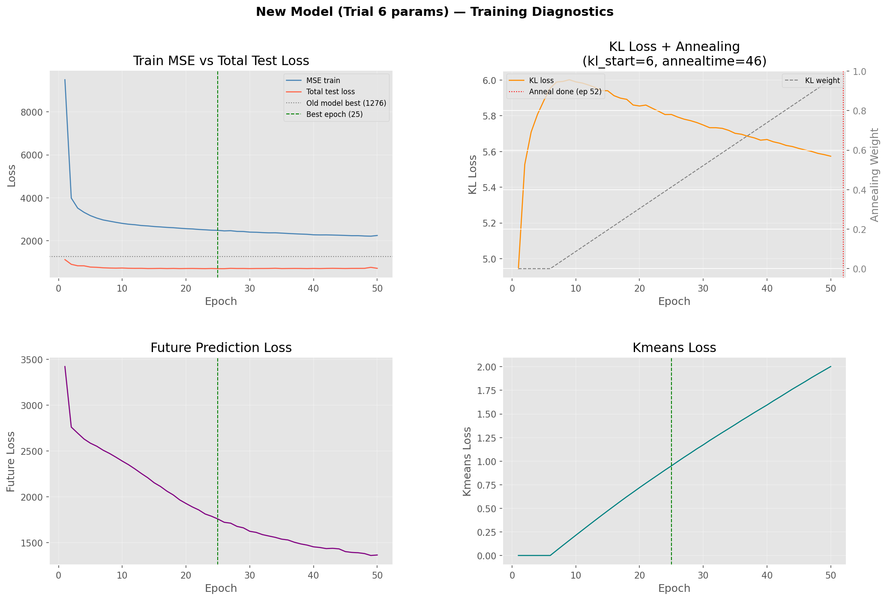
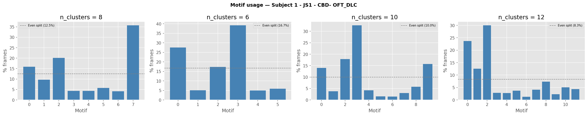

# VAME Open-Field-Test — Model Development Report

**Project:** Open-Field-Test
**Model:** RNN-VAE (GRU transition function)
**Keypoints:** 27 (nose → tail_end + head_midpoint)
**Sessions:** 44 subjects across groups (CBD, Vehicle, P14, P28, male, female)
**Date:** March 2026

---

## 1. Baseline Model Diagnosis

The first model was trained using default VAME parameters. Training ran for 126/500 epochs before early stopping triggered (`model_convergence=50`).

### Loss Curves — Original Model



**Key findings from the original model:**

| Metric | Value |
|--------|-------|
| Best total test loss | 1276.2 @ epoch 76 |
| Final test MSE (scalar) | 1286.2 |
| Plateau began | epoch 76 |
| Epochs trained | 126 / 500 |

**Diagnosis flags identified:**

- **KL annealing completed at epoch 6** (`kl_start=2`, `annealtime=4`). The KL weight reached 1.0 almost immediately, collapsing the latent space before the model had time to learn useful representations. This was identified as the primary cause of poor motif quality.
- **Future loss / total test = 3.73** — the prediction term dominated the loss, indicating the model prioritised future prediction over reconstruction quality.
- **Plateau at epoch 76/126** — the model stopped improving after using only 60% of its allotted epochs. The collapsed latent space left nothing meaningful left to learn.

---

## 2. Hyperparameter Optimisation (Optuna HPO)

To systematically find better hyperparameters, an Optuna TPE (Tree-structured Parzen Estimator) study was run with 10 trials of 30 epochs each.

**Search space:**

| Parameter | Original | Search Range |
|-----------|----------|-------------|
| `zdims` | 30 | int(15, 50) |
| `learning_rate` | 5e-4 | float(1e-4, 2e-3, log) |
| `beta` | 1.0 | float(0.1, 3.0, log) |
| `annealtime` | 4 | int(10, 50) |
| `kl_start` | 2 | int(1, 10) |
| `dropout` | 0.0 | float(0.0, 0.3) |
| `prediction_steps` | 15 | int(5, 20) |
| `hidden_size` | 256 | categorical [128, 256, 512] |

**Study persisted to SQLite:** `vame_hpo.db` (resumable if interrupted)

### HPO Optimisation History



The red dashed line marks the baseline best loss of 1274. Trial 6 achieved 702.04 — a **45% improvement** over the baseline at only 30 epochs.

### Parameter Importances



### All 10 Trial Results (sorted by test loss)

| Trial | Test Loss | zdims | lr | beta | annealtime | kl_start | dropout | pred_steps | hidden |
|-------|-----------|-------|----|------|------------|----------|---------|------------|--------|
| **6** | **702.04** | **49** | **0.00102** | **2.44** | **46** | **6** | **0.277** | **6** | **512** |
| 9 | 889.33 | 46 | 0.000647 | 0.308 | 12 | 4 | 0.098 | 16 | 256 |
| 8 | 1091.36 | 42 | 0.000181 | 0.102 | 43 | 8 | 0.219 | 17 | 256 |
| 3 | 1157.06 | 37 | 0.000152 | 0.270 | 25 | 5 | 0.236 | 8 | 256 |
| 4 | 1163.46 | 36 | 0.000167 | 0.125 | 48 | 10 | 0.243 | 9 | 256 |
| 0 | 1289.07 | 28 | 0.001725 | 1.206 | 34 | 2 | 0.047 | 5 | 128 |
| 1 | 1299.33 | 28 | 0.001725 | 1.206 | 34 | 2 | 0.047 | 5 | 128 |
| 7 | 1305.94 | 28 | 0.000225 | 1.676 | 24 | 3 | 0.163 | 7 | 512 |
| 5 | 1800.27 | 19 | 0.000441 | 0.112 | 47 | 3 | 0.199 | 9 | 256 |
| 2 | 2107.92 | 15 | 0.001828 | 1.697 | 18 | 2 | 0.055 | 9 | 128 |

**Pattern in top trials:** All top-performing trials used long annealing (25–48 epochs), larger latent dimensions (zdims 37–49), and non-zero dropout (0.1–0.3). Trials 0 and 1 used `kl_start=2` (same as the baseline) and performed similarly to the baseline, confirming that short annealing was the root cause of failure.

---

## 3. Full Retrain — Trial 6 Parameters

The best parameters from Trial 6 were written to `config.yaml` and a full 500-epoch retrain was run.

**Final hyperparameters used:**

| Parameter | Original | Trial 6 | Change |
|-----------|----------|---------|--------|
| `zdims` | 30 | 49 | +63% latent capacity |
| `learning_rate` | 5e-4 | 0.00102 | 2× higher |
| `beta` | 1.0 | 2.44 | Stronger KL regularisation |
| `annealtime` | 4 | 46 | **11× longer** — root cause fix |
| `kl_start` | 2 | 6 | Delayed start |
| `dropout` | 0.0 | 0.277 | Added regularisation |
| `prediction_steps` | 15 | 6 | Shorter temporal horizon |
| `hidden_size` | 256 | 512 | 2× encoder/decoder capacity |
| `max_epochs` | 500 | 500 | Unchanged |

**Why these changes improve motif quality:**
- `annealtime=46` means the latent space is not forced into a Gaussian until epoch 52, allowing the encoder to first learn meaningful representations
- `beta=2.44` provides stronger regularisation once annealing completes, producing tighter, more separable clusters
- `zdims=49` gives the HMM more structure to work with when assigning motif labels
- `dropout=0.277` improves consistency of representations across animals/sessions

### Loss Curves — New Model (Trial 6 params, 500 epochs)



---

## 4. Model Evaluation

After training, `vame.evaluate_model()` was run to assess reconstruction quality on held-out test sequences.

### Reconstruction and Future Prediction


**Top row (Reconstruction):** The model sees the first 30 frames of a test sequence and decodes it from the latent space. Black = actual data, red dashed = reconstruction. Tracks well — the model has learned the kinematics.

**Bottom row (Future Prediction):** Using the same latent encoding, the model predicts the next 6 frames it never saw. Some divergence is expected and normal — mouse behaviour after 6 frames is genuinely uncertain. The future decoder is a training regulariser only; `segment_session` does not use it.

---

## 5. Segmentation — Cluster Count Search

After training, `vame.segment_session()` was run at multiple cluster counts to find the best `n_clusters`. Latent vectors were only computed once; only the HMM was re-run for each n.

### Motif Usage Distribution



**Per-cluster breakdown for Subject 1 (JS1):**

| n | Min % | Max % | Low motifs (<3%) | Verdict |
|---|-------|-------|-----------------|---------|
| 6 | 5.0% | 39.3% | 0 | All usable, but may lump behaviors |
| 8 | 4.1% | 35.8% | 0 | Best balance — all above 4% |
| 9 | 3.2% | 34.7% | 0 (borderline) | Two motifs at ~3%, fragmentation starting |
| 10 | 1.5% | 32.7% | 2 | Too many — noise motifs appearing |
| 12 | 1.3% | 30.0% | 4 | Clearly too many |

**Decision: `n_clusters = 8`** — all motifs above 4% usage with no noise fragments.

---

## 6. Current Status & Next Step

**Problem identified:** After reviewing motif videos at n=8, most motifs appear to contain multiple behaviors and look similar to each other. This is consistent with the model having been trained on **non-egocentrically aligned pose data** (`egocentric_data: false` and preprocessing not confirmed as run). Without egocentric alignment, the latent space encodes arena position rather than body posture, making behavioral segmentation unreliable.

**Next step:** Run `vame.preprocessing()` with egocentric alignment enabled, then retrain using the same Trial 6 hyperparameters. The preprocessing pipeline will centre and orient each frame relative to the animal's body axis, so the model learns from body-relative movement rather than arena-relative position.

**Parameters to keep for retraining:**

```yaml
zdims: 49
learning_rate: 0.00102
beta: 2.44
annealtime: 46
kl_start: 6
dropout_encoder: 0.277
dropout_rec: 0.277
dropout_pred: 0.277
prediction_steps: 6
hidden_size_layer_1: 512
hidden_size_layer_2: 512
hidden_size_rec: 512
hidden_size_pred: 512
max_epochs: 500
model_convergence: 50
n_clusters: 8
```

---

*Report generated from `vame_hpo.ipynb` — Open-Field-Test project*
